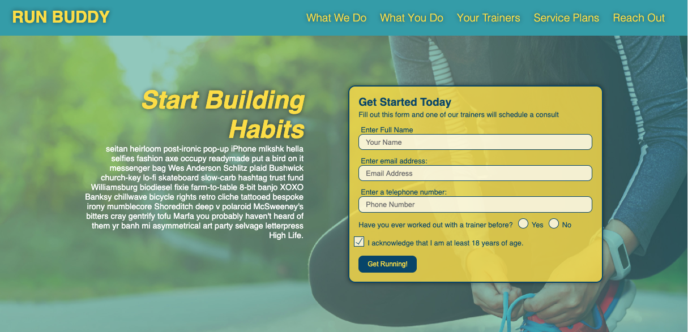

# Run Buddy, Inc
Lesson 2 Practice | Advanced CSS

## Student Name
Tara Brichetto

## Creation Date
08 August 2020

## Purpose
A practice assigment to build on foundational HTML, CSS, and Git skills while learning advanced CSS.

## Languages
* HTML
* CSS

## Links
Deployed Application | https://tbrichet.github.io/run-buddy/  
Github Repository | https://github.com/tbrichet/run-buddy  

## Programs and Contributions
* Practice assignment provided by U of A Coding bootcamp  

## Screenshot

